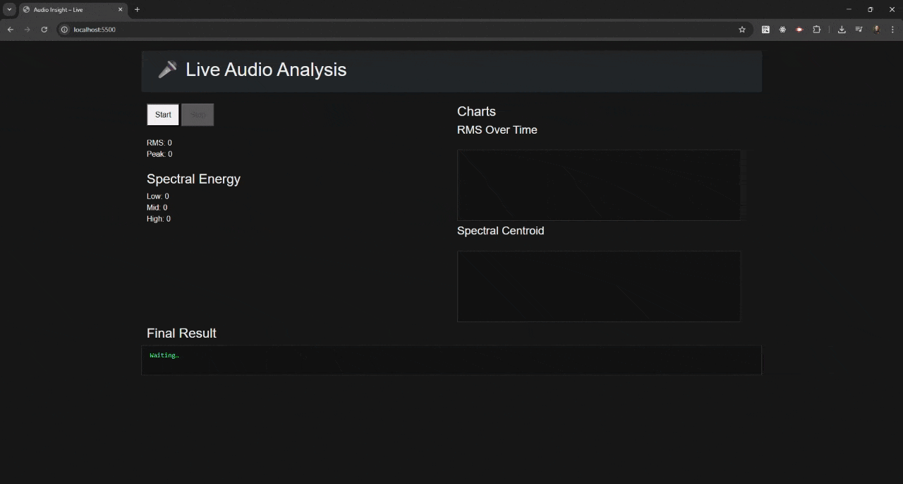

# Audio Insight & Quality Analysis Service
 A backend service that analyzes digital audio files and extracts technical and perceptual audio quality metrics, such as loudness, silence ratio, and spectral energy distribution. The project is designed as a small but real-world backend system, inspired by audio streaming and telecom pipelines, with a clear evolution path from offline DSP to real-time analysis. 
 
 ## Architecture (Offline DSP Phase)
  - Client uploads audio via HTTP (multipart/form-data) 
  - Go API handles request lifecycle and job tracking 
  - FFmpeg decodes audio into mono PCM 
  - DSP analysis is implemented entirely in Go 
  - Results are returned synchronously as structured JSON 
  - Architecture is designed to be reusable for streaming 
  ## Tech Stack 
  - Go: HTTP API, Job lifecycle management, DSP analysis (RMS, peak, silence, spectrum) 
  - FFmpeg: Audio decoding to mono PCM (16-bit) 
  - Gonum (FFT): Frequency-domain analysis 
  ## Implemented Audio Metrics

- Duration (seconds) 
- RMS (average signal power) 
- Peak amplitude - Silence ratio 
- Spectral centroid 
- Low / Mid / High frequency energy bands 

    
------------- 

### Offline Audio Analysis (Foundation) Request
```ash
curl -X POST http://localhost:8080/analyze   -F "audio=@percLoop.wav"
```
Response
```json
{
"id":"07926996-5999-43ea-b6b0-ca652cdbac27",
"status":"done",
"result":
    {
    "duration_seconds":7.5,
    "rms":0.01992344219382106,
    "peak":0.602294921875,
    "silence_ratio":0.6898503401360544,
    "spectral_centroid":4741.869914131183,
    "low_energy":31912.591789650374,
    "mid_energy":254045.28764874054,
    "high_energy":574943.9057751946
    },
"created_at":"2026-01-29T02:16:14.5216644+01:00",
"updated_at":"2026-01-29T02:16:14.6683508+01:00"
}
```
### Offline DSP is the foundation of real-time DSP. 
Offline DSP serves as the ground truth for all future real-time features: 
- Same DSP code is reused for streaming 
- Frame-based analysis mirrors live audio windows 
- Guarantees correctness before adding latency constraints 
- Makes WebSocket and AudioWorklet integration predictable 

Real-time DSP is just offline DSP running continuously on small windows.


## Real-Time Audio Analysis (Live Streaming)

This phase extends the offline DSP foundation into **real-time audio streaming**, enabling live analysis of microphone input with low latency.

### Architecture Overview

- Browser captures microphone audio using **Web Audio API**
- Audio frames are processed in an **AudioWorklet**
- Raw PCM frames are streamed to the backend via **WebSocket**
- Go backend runs the same DSP logic on small time windows
- Analysis results are pushed back to the client in real time
- UI updates meters and charts continuously

Real-time DSP reuses the exact same analysis code as offline DSP, applied repeatedly on short audio frames instead of full files.
 

### Frontend UI Architecture
The browser UI is intentionally modular and minimal:
```
web/
 ├── index.html
 ├── main.js                # App bootstrap
 ├── ws/
 │    └── wsClient.js       # WebSocket client logic
 ├── audio/
 │    ├── audioEngine.js    # AudioContext + wiring
 │    └── audioProcessor.js # AudioWorkletProcessor
 └── ui/
      ├── meters.js         # RMS / Peak display
      └── charts.js         # RMS & centroid charts

```
### Data Flow

```
Microphone
   ↓
AudioWorklet (PCM frames)
   ↓
WebSocket (binary audio)
   ↓
Go DSP Engine (frame-based)
   ↓
WebSocket (JSON stats)
   ↓
Live UI (meters & charts)
```

### Live Metrics Displayed

- RMS (over time)
- Peak
- Spectral centroid (over time)
- Low / Mid / High frequency energy
- Final aggregated values on stop

Charts update continuously while recording and freeze when stopped, showing the final analysis result directly in the UI.

## Design Goals

- No duplicated DSP logic
- Deterministic results between offline and live modes
- Minimal latency, predictable behavior
- Architecture ready for:
    - Recording
    - Aggregation
    - Monitoring dashboards
    - ML-based audio quality scoring

## Live Demo
Below is a short demo showing the real-time audio analysis UI in action.

- Microphone audio is captured in the browser
- Audio is streamed frame-by-frame
- Metrics are computed live
- Charts update in real time
- Final values remain visible after stopping

This demo focuses on observability and architecture, not final UI polish.
It demonstrates how offline DSP logic transitions naturally into real-time streaming.


